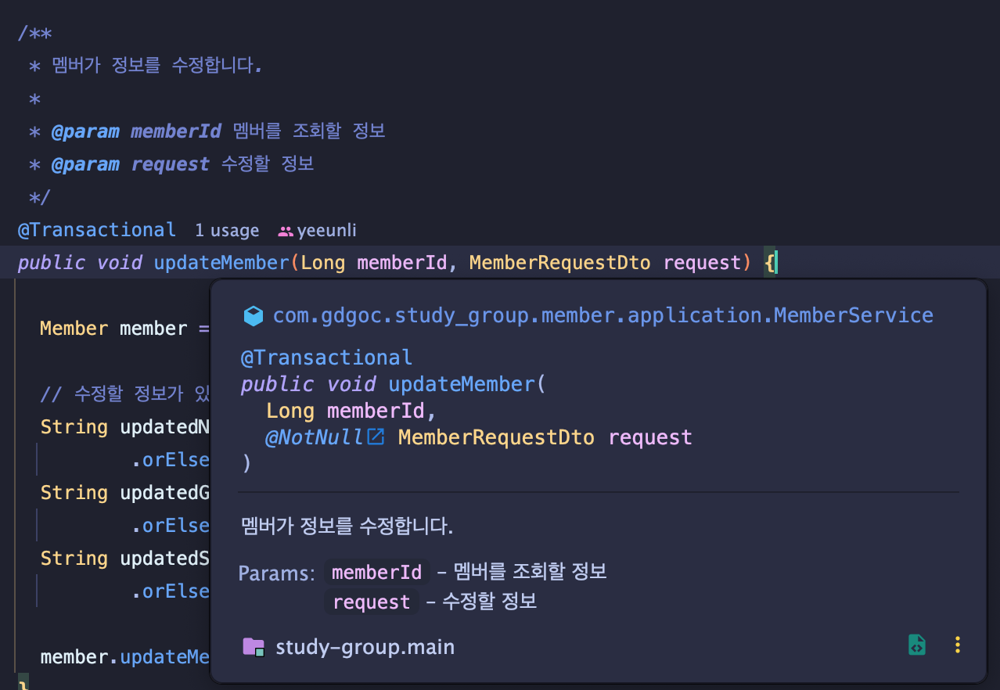

# Mission Course Week3
2주차 과제에서는 프로젝트를 위해 필요한 지식을 공부했어요.  
해당 내용이 추후 프로젝트에 도움이 되셨으면 좋겠네요!  
  
PR 리뷰는 추후 협업에서 필수적으로 해야 하는 작업이에요.  
이에 대한 맛보기로써 감을 조금 잡으셨으면 좋겠어요!  

2주차에서는 프로젝트에 관한 공부였다면,  
3주차에서는
* 주석을 다는 방법
* `Spring` 자체에 관한 공부  


에 관해 공부해볼 예정이에요.  
여기서는 먼저 주석에 대해 알아봅시다.

## 협업을 위한 주석, JavaDoc 과 Swagger

### 개요
협업을 하게 되면, 본인이 작성하지 않은 코드를 보게 됩니다.  
아무래도 본인이 작성한 코드가 아니기 때문에, 어떤 기능을 하는지 자세히 살펴보아야 해요.  
[해당 글](https://bayrhammer-klaus.medium.com/you-spend-much-more-time-reading-code-than-writing-code-bc953376fe19)을
참고해 보시면, 사실 개발자는 코드를 작성하는 시간보다 읽는 시간이 더 많다고 해요.  
이처럼 코드를 **잘 읽을 수 있도록** 작성하는 것도 중요한 일입니다.

JavaDoc 과 Swagger 는 기본적으로 제공하는 주석기능에 추가기능이 달린 어떤 개발자 도구입니다.  
서비스의 사용자에게 보이지 않지만, 같은 개발자에게 코드에 대한 가이드를 주는 아주 중요한 기능이에요.  

**JavaDoc** 은 특히 같은 백엔드 개발자에게,  
**Swagger** 는 프론트엔드 개발자에게 중요해요.  
하나하나씩 살펴봅시다!

### 미션 내용

#### JavaDoc
JavaDoc 은 메소드에 작성하는 어떤 기능을 수행하는 주석이에요.  
메소드 위에
```java
/**
 * 
 */
```
안에 주석을 작성함으로써 사용할 수 있어요.  
대부분의 IDE 에 JavaDoc 이 내장되어있어, 따로 설치가 필요하진 않아요.  

JavaDoc 을 효율적으로 사용하기 위해서는 JavaDoc 만의 문법을 조금 알 필요가 있어요.  
문법은 보통 `@` 와 조합되는 특정 키워드로 사용되는데, 자주 사용하는 키워드가 많지 않으니 걱정 안 하셔도 돼요.  

다음의 2가지 자료를 드리지만 두 자료는 가볍게 읽어보시고, 따로 검색해서 익혀서도 좋을 것 같아요!

* [Intellij JavaDocs](https://www.jetbrains.com/help/idea/javadocs.html#custom-tags-javadocs)
* [Oracle: How to Write JavaDoc](https://www.oracle.com/technical-resources/articles/java/javadoc-tool.html)

메소드에 작성하면 인텔리제이에서는  

위와 같이 작성한 내용을 기반으로 힌트를 주기 때문에, 메소드 정의 부분을 찾아가지 않아도 됩니다.  

---

#### Swagger
Swagger 는 작성한 주석을 기반으로 API 명세서를 자동으로 만들어주는 개발자 도구에요.  
배포 후에 프론트엔드 측에서 이 Swagger 로 만들어진 API 명세서를 보고 작업하는 경우가 많아요.  
JavaDoc 과는 달리 페이지가 따로 생성되기 때문에 약간의 설정이 필요해요.

역시 주석 기반으로 특정 문법으로 작성해야 합니다.  
주로 API에 대한 주석이기 때문에 `Controller` 에 많이 작성하게 됩니다.

공식적인 자료로는
[Swagger-Core](https://github.com/swagger-api/swagger-core/wiki/Swagger-2.X---Getting-started)
가 있습니다만...  
인터넷에서 검색해서 찾아보시는 걸 추천해 드립니다. 문서가 그리 친절하진 않습니다.  

설정과 주석을 모두 작성하고 나면, 다음과 같은 예제처럼 프론트엔드 측에서 사용할 수 있습니다.  
[Swagger 예제](https://petstore.swagger.io/)

#### TODO
* JavaDoc 과 Swagger 에 관해 공부하고 정리한 내용을 [WIL](../../week3/WIL.md) 에 작성하기
* 1주차의 쇼핑물 프로젝트에 JavaDoc 과 Swagger 적용하기
* **Extra**: 메소드를 정리하면서 리팩토링하기 