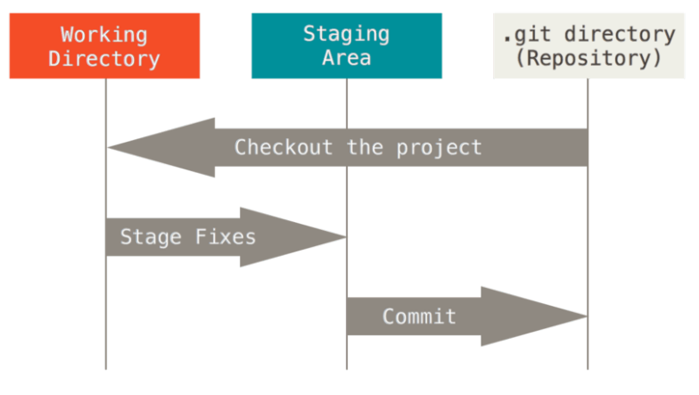
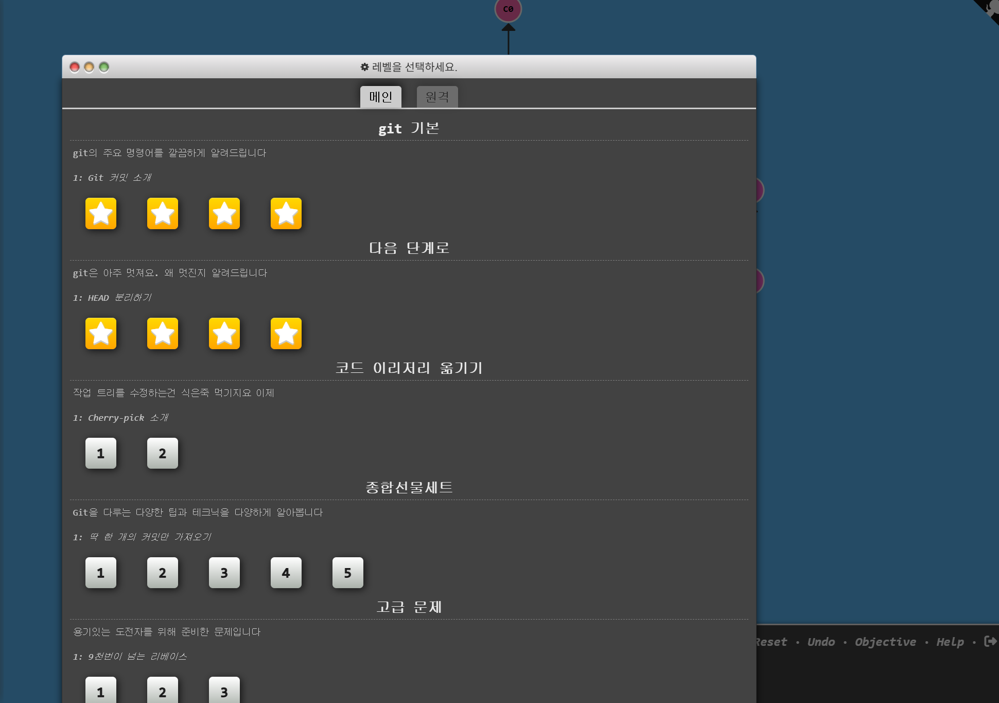
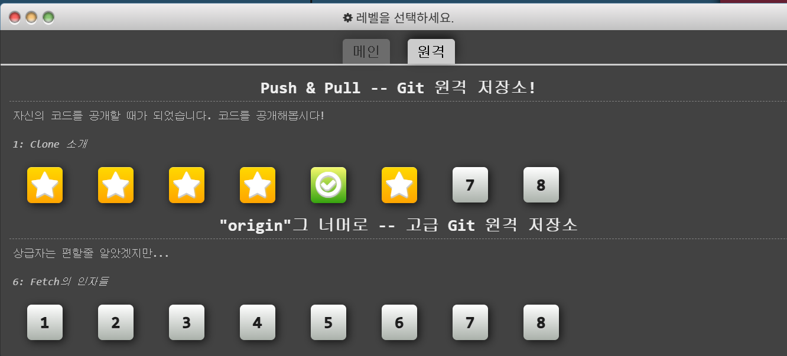

# 1주차 WIL 적는 곳
git: 버전관리 프로그램(버전관리: 파일 변화를 시간에 따라 기록했다가 특정 시점의 버전을 다시 꺼내올 수 있는 시스템)
git add 파일명: 파일명에 해당하는 파일을 고름
git add .: 해당하는 모든 파일 고름
git commit -m "message" : add한 파일을 기록

작업 폴더  -add->  staging area -commit-> repositary

git branch file: 파일명에 해당하는 branch 생성
git checkout file: 해당 파일로 이동
git merge file

git checkout file^: 파일의 부모 커밋으로 이동
git checkout file~num: 파일의 부모 커밋 방향으로 num번 이동
git checkout -f file1 file2~3: 파일1을 파일2에서 세번 뒤로 옮김 
git reset HEAD~1: HEAD위치에서 한번 뒤로 옮기고 이전 파일을 없는 취급
git revert HEAD: 복구
HEAD: 현재 체크아웃된 커밋
git push: 내 local 디렉토르로 부터 remote repository로 파일을 보냄
git push -u: 자동으로 origin(원격 저장소)의 master브런치로 연결 => 간단히 git push, git pull로 원격저장소와 로컬저장소간 상호작용 가능
git pull: fetch+merge => 원격저장소에서 업데이트 했을때 내 로컬저장소의 상태를 동일하게 함
git clone: contribute하거나 git저장소를 복사하고 싶을 때 사용, 프로젝트 히스토리를 전부 받아옴, gtihub repositary내용을 사용자의 로컬 저장소로 가져옴옴
git fork: github에서 다른 사용자의 repositary의 내용을 본인의 repositary로 복사해 가져옴

git 실습 사진

