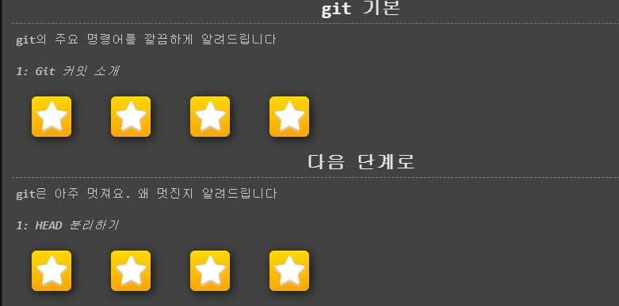
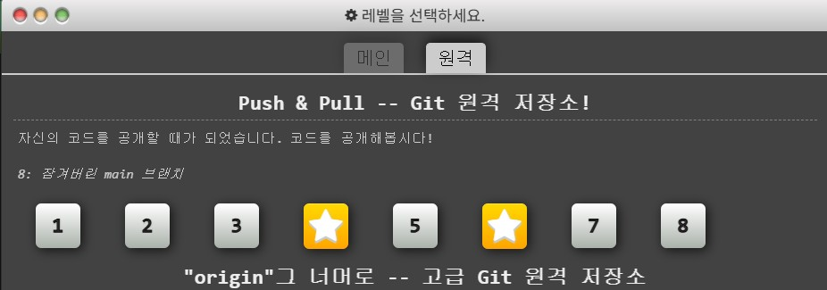

# 1주차 WIL

## Git
- Git이란?
  * 파일을 수정하고 저장하다보면 이전의 상태로 되돌리거나 이전의 파일이 필요할 때가 있다. 특히 여러 사람이 작업할 때에는 이런 상황이 빈번하게 발생할 것이다. 이 때 필요한 것이 VCS(버전 관리 시스템)이다. Git은 이러한 VCS의 일종이다.
- add와 commit
  * git add 명령어를 통해 파일을 Staged 상태로 만들 수 있다. 그 후 git commit을 이용하여 Staged 상태의 파일을 commit 할 수 있다.
- push와 pull
  * 원격 저장소에 저장 된 내용을 나의 git pull을 이용하여 나의 로컬 저장소에 저장할 수 있다. 반대로 나의 로컬 저장소에서 변경된 내용을 git push 하여 원격 저장소에 저장할 수 있다.
- fork와 clone
  * 코드를 fork해서 나의 github에 복사할 수 있고, git clone을 통해 이를 나의 로컬 저장소에 저장할 수 있다.

## Git 실습 결과 사진

