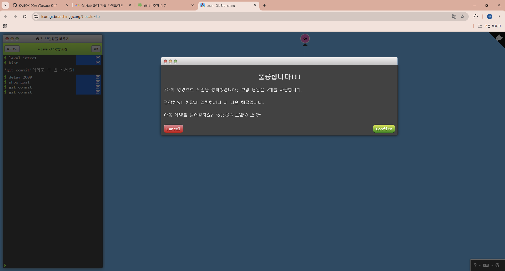
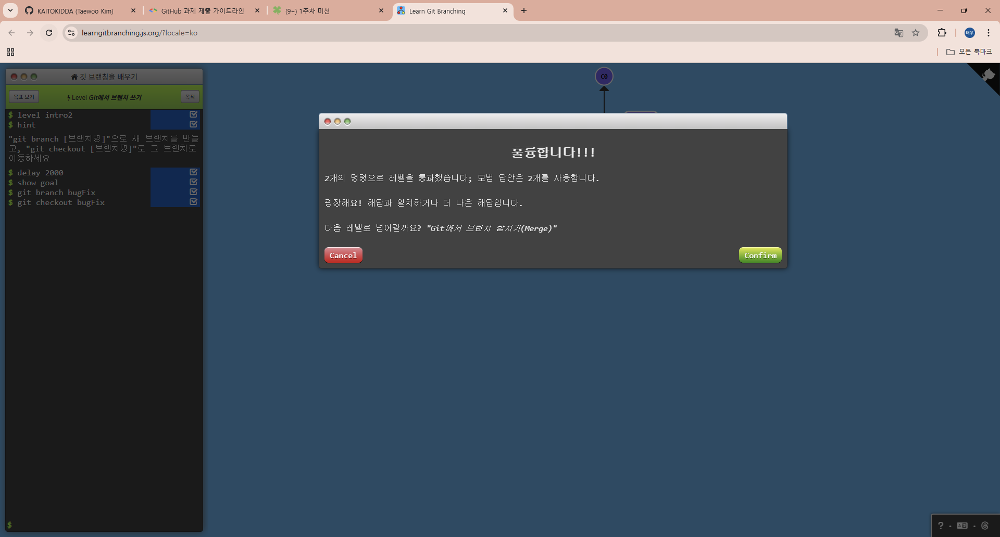
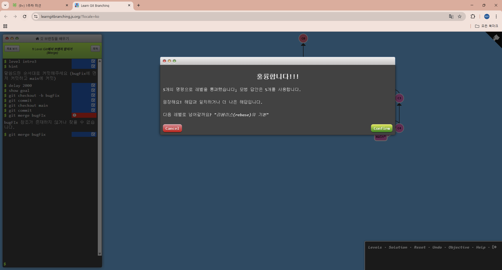
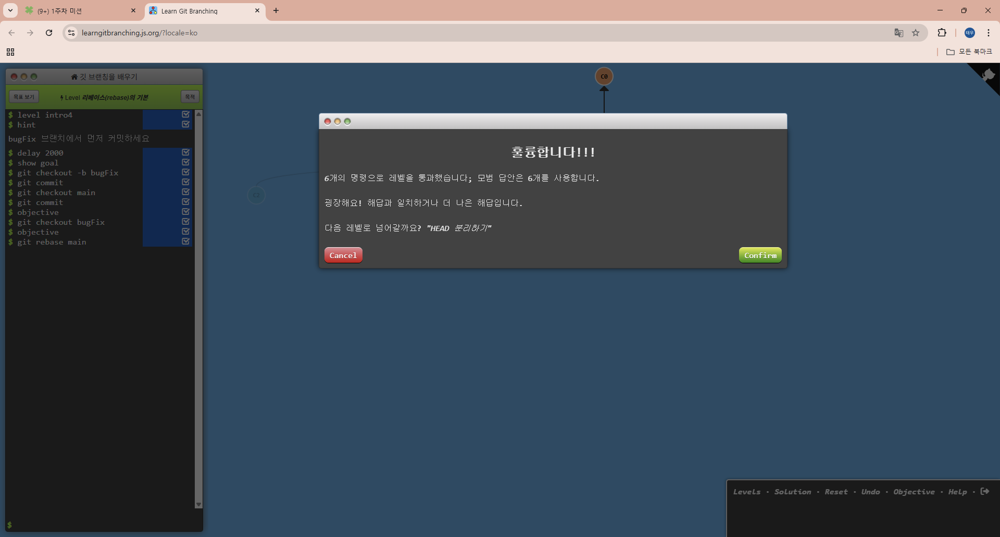
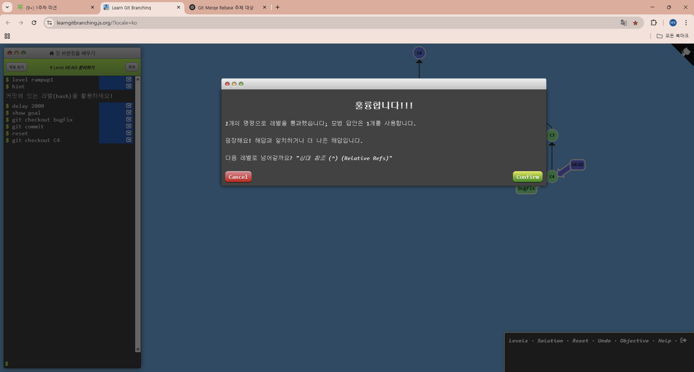
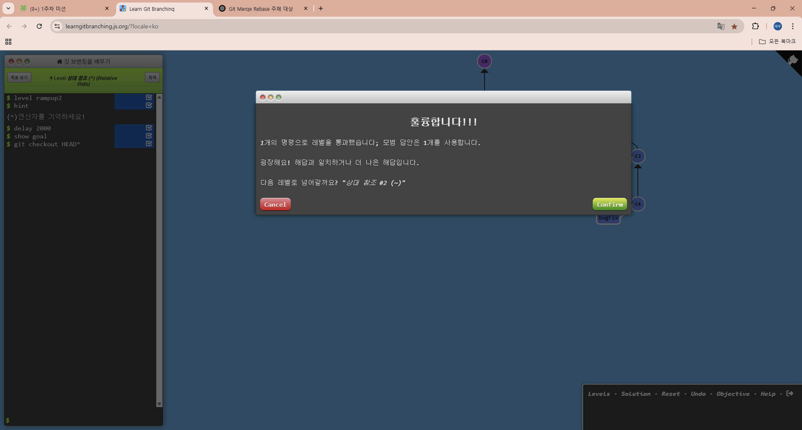
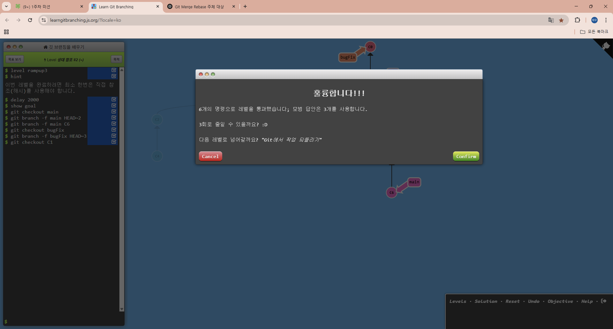
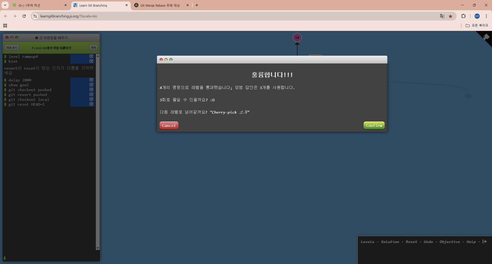
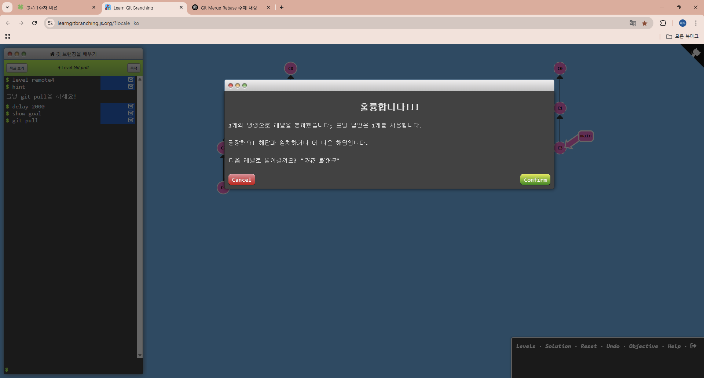

# 1주차 WIL 적는 곳

## git관련 학습 내용

- **Git**은 VCS(Version Control System)의 일종으로, 코드 변경 이력을 관리하고 협업에 핵심적인 역할을 하는 도구이다. Git을 통해 개발자들은 각자의 작업을 브랜치로 분리하여 진행한 뒤, 문제가 없다고 판단되면 원본(Main)에 병합할 수 있어 충돌을 최소화하고 생산성을 높일 수 있다.

- **add / commit**
    - `add`는 변경된 파일을 staging area에 올리는 명령어다..
    - `commit`은 staging된 파일을 하나의 스냅샷으로 저장하는 것으로, 프로젝트의 이력을 남긴다.

- **push / pull**
    - `push`는 로컬에서 commit한 내용을 원격 저장소(GitHub 등)에 업로드하는 작업이다.
    - `pull`은 원격 저장소의 최신 변경사항을 로컬로 가져와 병합하는 과정이다.

- **fork / clone**
    - `fork`는 다른 사람의 GitHub 저장소를 내 계정으로 복사하여 독립적으로 관리할 수 있게 해준다.
    - `clone`은 원격 저장소의 내용을 로컬 컴퓨터로 복제하는 명령어이다.

이러한 명령어들은 실제 프로젝트 협업에서 거의 매일 쓰이게 되며, 특히 코드 리뷰 및 배포 자동화 등과도 밀접하게 연동된다.

- **merge**는 "대상을 가져와서 내 쪽으로 합치는 것"
- **rebase**는 "내 것을 대상 위로 옮기는 것"
- **HEAD**의 이동 : **checkout** 시 해당 브랜치 위치로 이동한다.
- **detached HEAD** : **커밋 ID**(해시값)를 직접 체크아웃하면, **HEAD**는 브랜치를 안 가리키고 직접 해당 커밋을 가리킨다.

---

## git 실습

