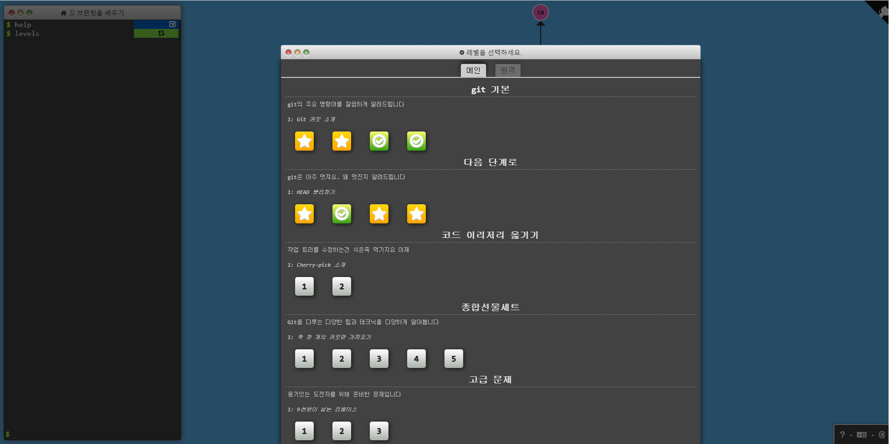
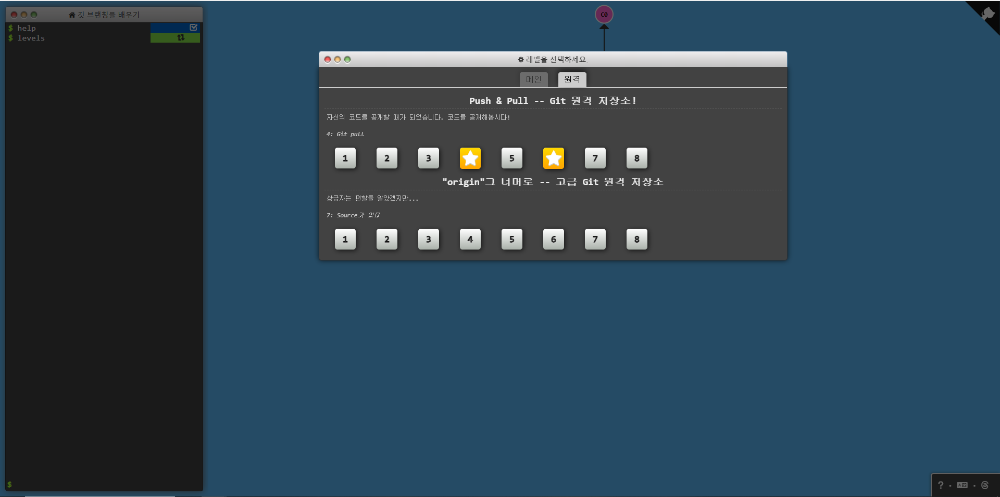

# Week 1

# Git

Git은 VCS(Version Control System)의 한 종류이다.

VCS는 파일 내용의 변화를 시간에 따라 기록해 놓고 이후에 특정 시점의 파일 버전을 다시 꺼내올 수 있는 시스템이다.

## 버전 관리란 ?

1. 각 파일을 특정 시점의 상태로 되돌릴 수 있다.
2. 프로젝트 전체를 특정 시점의 상태로 되돌릴 수 있다.
3. 시간에 따른 수정 내용을 알 수 있다.
4. 수정된 파일 내용의 작성자와 수정 시간을 알 수 있다.
5. 파일을 잃어버리거나 잘못된 수정을 했을 때 복구할 수 있다.

## Git의 필요성

여러 사람이 함께 일하는 협업 환경에서 동시에 같은 파일에 대한 수정을 진행하게 되면, 충돌이 발생할 수 있다.

Git은 각 수정사항에 대해 서로 다른 복사본을 만들어 충돌이 발생하지 않도록 해준다.

## Git의 장점

- 소스코드를 주고 받을 필요 없이 같은 파일을 여러 명이 동시에 작업할 수 있다.
    - Branch→ Merge
- 분산 버전 관리 : 인터넷이 없이도 않아도 개발 가능, 중앙 서버에서 문제가 생겨도 복구 가능.

## Git 용어 정리

- Repository : Stage에서 대기하고 있던 파일을 버전으로 만들어 저장하는 공간
    - Local Repository : 내 PC에 저장되는 개인 저장소, 직접 만들거나 Remote Repository을 복사
    - Remote Repository : 여러 사람이 파일을 공유하기 위한 저장소
- Working Directory : 작업자의 현재 상태

  → 파일 수정, 저장을 하는 디렉터리

- Snapshot : 특정 시점에서 파일, 폴더, 워크 스페이스의 상태.
    - 특정 시점의 저장소의 모든 상태를 확인.
    - commit을 통해 스냅샷을 저장.
- Checkout : 이전 버전을 불러오기
- Staging Area : 저장소에 Commit하기 전에 대기하는 공간
- Head : 현재 작업중인 Branch
- Branch : 분기점, 수정할 파일을 복사(Branch)한 이후에 수정 후 Merge하는 방식으로 작업한다
- Merge : 여러 개의 Branch를 합치는 작업

## Git 명령어

1. add : 변경된 파일을 Working Directory 에서 Staging Area에 추가하는 작업, commit 대기
2. commit : 변경된 파일을 Local Repository에 Snapshot으로 저장하는 작업
    - 변경사항의 내용을 요약하는 메시지와 함께 남김.
3. push : Local Repository에 있는 변경사항을 Remote Repository에 업로드 하는 작업
4. pull : Remote Repository의 변경사항을 Local Repository으로 가져오는 작업
5. fork : 다른 사람의 저장소를 복사해서 내 저장소로 가져오는 것
6. clone : Remote Repository에 있는 내용을 Local Repository에 복사하는 것

## CRUD

데이터에 대해 Create Read Update Delete 하는 것으로 서버의 가장 기본적인 기능

일반적인 프로젝트는 3-Tier Architecture를 활용

1. Repository Tier : 데이터베이스 작업이 이루어짐.
2. Service Tier : 데이터를 가공하는 역할, 비지니스 로직이 사용됨.
3. Web Tier : 가공된 정보를 표현, 프론트엔드에서 보여주는 사이트에 해당됨.

→ 백엔드는 주로 Repository, Service Tier를 개발하게 됨.

→ 데이터를 조작하고 가공하여 프론트엔드에 전달 (CRUD)