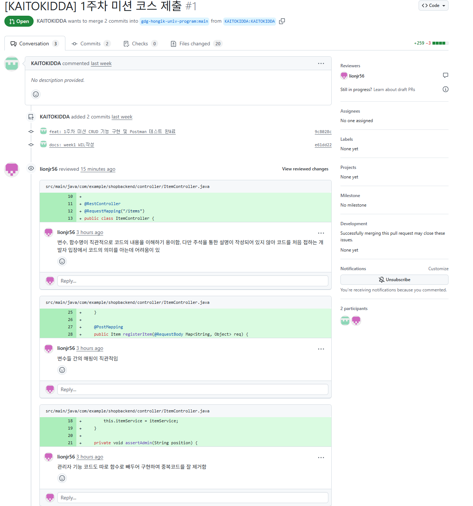

# 2주차 WIL 적는 곳
1. 이번 주 배운 것

- 팀원의 프로젝트를 리뷰

- 프로젝트를 위한 지식 공부

2. 배운 내용

- 팀원의 프로젝트 리뷰 

  gdg프로젝트 트랙 팀원 한분의 코드를 review하였다. 다만 내가 JAVA코드의 가독성이나 표현 방식을 완전히 이해하지는 못해서 전반적으로 프로그래밍 할 때 긍정적인 반응을 받은 만한 포인트 위주로 review하였다. 특히 함수명, 변수명이 정말 직관적이고 이해하는데 많은 도움을 주게 설정한 점을 위주로 작성하였다.

- 프로젝트를 위한 배경지식 공부

 1) 객체지향

    • 캡슐화 

          - 객체를 캡슐로 싸서 내부를 보호함. JAVA의 경우 클래스는 객체의 모양을 선언한 틀, 필드와 Method를 클래스 내에 모두 

          구현하고 캡슐화를 통해 객체 내 필드에 대한 외부 접근 제한

    • 상속 

          - JAVA에서 자식 클래스가 부모 클래스의 속성을 물려받아 부모 클래스에 기능을 확장(extends)

     • 다형성

          - 같은 이름의 메소드가 클래스 혹은 객체에 따라 다르게 구현

   (1)결합도: 모듈과 모듈 간의 의존 정도

          - 좋은 소프트웨어는 낮은 결합도를 가지고 있다(낮은 결합도: 각 클래스가 다른 클래스에 대해 꼭 필요한 지식만 가지고 있음)

   (2)응집도: 한 모듈 내의 구성요소들 간의 연관 정도

          - 응집도가 높을 수록 독립성이 높은 모듈이며 좋은 소프트웨어는 높은 응집도를 유지

=> 높은 응집도와 낮은 결합도가 이상적인 소프트웨어 모듈

    (3)SOLID

        - 단일 책임 원칙(SRP, Single Responsibility Principle): 하나의 클래스는 하나의 책임(기능)을 가져야함 -> 프로그램의 유              지보수성을 높이기 위함

        - 개방 폐쇄 원칙(OCP, Open Closed Principle): 클래스를 확장을 통해  구현하며 확장에 따른 클래스 수정은 최소화 ->                   JAVA에서 추상 클래스와 상속을 통한 클래스 관계 구축을 권장

        - 리스코프 치환 원칙(LSP, Liskov Substitution Principle): 서브 타입은 언제가 기반(부모) 타입으로 교체할 수 있어야 함

        - 인터페이스 분히 원칙(ISP, Interface Segregation Principle): 인터페이스를 각각 사용에 맞게 끔 잘게 분리해야함-> 클라              이언트의 목적과 용도에 적합한 인터페이스 만을 제공

        - 의존 역전 원칙(DIP,Dependency Inversion Principle): 대상의 상위 요소(추상 클래스 or 인터페이스)로 참조하라는 원칙              (인터페이스에 의존)-> 각 클래스간의 결합도를 낮춤

     2) RESTful API

        (1) 네트워크 기본

           - IP : 송/수신 클라이언트에서 정보를 주고받을 때 사용하는 정보 위주의 프로토콜

              • 인터넷 데이터를 패킷에 포장하여 인터넷 망을 통해 전달

              • ip 패킷 구성

                   - 전송하고자 하는 데이터 블록

                   - 주소지 정보(발신지 주소, 목적지 주소)

                   - Header와 같이 인터넷 망이 패킷을 목적지까지 전달하는데 필요한 관리 정보

           - TCP : 전송 제어 프로토콜(데이터 전달 보증하고 순서를 보장하는 신뢰할 수 있는 프로토콜

              • 기능

                    - 데이터 전달 보증: 클라이언트가 데이터를 전송하면 서버에서 데이터 잘 왔는지 응답하여 데이터 전달 보증

                    - 순서 보장: 잘못 전송된 패킷을 기준으로 다시 보내라고 요청하여 다시 패킷을 받음

                  => TCP 데이터 내에 전송 제어, 순서, 정보 등이 들어 있기에 가능

           - UDP : 사용자 데이터그램 프로토콜, 데이터 전달/순서 보증 x, 오로지 빠르게 패킷을 보내는 것이 목적

TCP vs UDP 비교표

           - PORT : 컴퓨터 안의 어플리케이션 중 어느 프로그램에 전달해야 하는지에 대한 최종 목적지 정보(ip는 상대 클라이언트의               목적지만 가지고 있음)

           - DNS(도메인) : www.~

        (2) HTPP 기본

              -HTTP(Hyper Text Transfer Protocol) : 서버와 클라이언트가 서로 데이터를 주고받기 위해 사용되는 통신 규정

        (3) URL 구성요소

         
URL 구성
           - scheme : 주로 프로토콜 사용

           - userinfo : URL에 사용자 정보를 포함하여 인증

           - host : DNS(도메인)명 또는 IP주소를 직접 사용 가능

           - port : 접속 포트, 생략가능, 생략시 http는 80, https는 443 포트 번호로 설정, 톰캣은 8080 포트 사용

           - path : 리소스 경로

           - query : 웹서버에서 제공하는 파라미터,문자형태

           - fragment : html 내부 북마크 등에 사용, 웹문서 해시태그

        • URL의 웹 브라우저 요청 흐름 

 

        (4) Status code : 클라이언트가 보낸 HTTP 요청이 성공했는지 실패했는지를 서버에서 알려주는 숫자 코드

        (5) Stateful과 Stateless 

             -Stateful : 상태유지(서버가 클라이언트의 상태를 보존함)(ex: 홈페이지에 한번 로그인 하면 페이지를 이동해도 로그인이 풀리지 않고 유지 

             -Stateless : 무상태(서버가 클라이언트의 상태를 보존하지 않음), 통신에 필요한 모든 상태 정보들은 클라이언트에 가지고 있다가 서버와 통신할때 데이터를 실어 보냄

        (6) REST API 기본

            - REST 구성

                1) 자원 - URI

                2) 행위 - HTTP METHOD

                3) 표현

            - REST 특징

                1) Uniform(유니폼 인터페이스): URI로 지정한 리소스에 대한 조작을 통일되고 한정적인 인터페이스로 수행하는 아키텍쳐

                2) Stateless(무상태성)

                3) Cacheable(캐시가능)

                4) Self-descriptiveness(자체 표현 구조)

                5) Client-Server 구조

                6) 계층형 구조

             - REST API 디자인 가이드

                1) URI는 정보의 자원을 표현

                2) 자원에 대한 행위는 HTTP Method로 표현

    3) 클라우드 및 배포

        (1) CORS

        (2) 서버리

 

3. 느낀 점 ,공부 방향성

  일단 깃허브에 코드부터 수정하였다. 프로젝트 디렉토리의 구성이 뭔가 이상해서 다른 사람의 코드와 비교하니 프로젝트 안에 새로 프로젝트를 만든 형식이 되어 기존에 에러가 발생하였었다. 이를 수정하며 타인의 코드와 비교하니 확실히 길을 못 찾을때 좋은 지도가 되었다. 생소한 개념의 프로그래밍 관련 지식도 공부하였지만 이 개념이 정확히 어떤 걸 의미하는지 아직 갈팡질팡하였다.

다음주에는 postman연결을 통한 api 연결을 마무리 하고 프로젝트, 코드의 구조를 다시 이해하는 시간을 가질 예정이다.