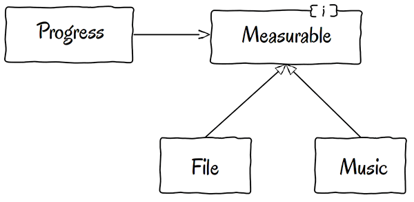

# Week 2

## 1. 결합도와 응집도

모듈화 : 큰 문제를 작은 문제로 쪼개는 것.

모듈 :  소프트웨어에서 기능별로 나누어진 소스 단위. 독립적으로 컴파일 가능한 프로그램, 함수, 클래스

좋은 모듈화를 위해서는 목적에 맞는 기능만으로 모듈을 나누어야한다.

모듈화를 잘 하면 각각의 모듈들은 독립적으로 기능을 수행해, 재사용성이 높고 유지보수가 용이하다.

모듈들의 독립성은 결합도와 응집도이 단계로 측정할 수 있다.

→ 결합도는 느슨할수록, 응집도는 높을수록 독립성이 높게 평가된다.

### 결합도 (Coupling) : 모듈(클래스)간의 상호 의존 정도

- 결합도가 높을수록  다른 클래스에 의존하는 정도가 높다.
- 하나의 클래스의 수정을 위해 의존하고 있는 클래스까지 수정해야 할수도 있음.
    
    → 유지보수 측면에서 불리함
    
- 결합도가 낮은 클래스는 OCP(Open Closed Principle을 잘 지킨 클래스이다
    - OCP : 기존의 코드를 변경하지 않으면서 기능을 추가할 수 있도록(확장) 설계하는 원칙.F
        
        
        

File의 종류를 Measureable이라는 하나의 인터페이스로 통합 → 파일의 종류를 추가하기 용이하고, Progress를 수정하지 않아도 된다.

| 자료 결합도 | 모듈간의 인터페이스로 전달되는 파라미터를 통해서만 상호작용이 일어남 (가장 낮은 결합도) |
| --- | --- |
| 스탬프 결합도 | 모듈간의 인터페이스로 배열/객체/자료 구조 등이 전달되는 경우 |
| 제어 결합도 | 어떤 모듈이 다른 모듈의 논리적인 흐름을 제어하는 제어 요소를 전달하는 경우 |
| 외부 결합도 | 어떤 모듈이 외부에 있는 다른 모듈의 데이터를 참조하는 경우 (데이터, 통신 프로토콜 …) |
| 공통 결합도 | 여러 개의 모듈이 하나의 공통 데이터 영역(전역 변수에 대한 참조, 갱신)을 사용하는 경우 |
| 내용 결합도 | 어떤 모듈 내부에 있는 변수 또는 기능을 다른 모듈에서 사용하는 경우 ( 가장 높은 결합도)  |
1. 자료 결합도 (Data Coupling) : 가장 낮은 결합도
- 순수한 자료형 요소의 데이터만을 주고 받는 경우
- 한 모듈을 변경하더라도 다른 모듈에 영향을 주지 않음.

1. 스탬프 결합도 (Stamp Coupling) 
- 두 모듈이 인터페이스로 배열이나 오브젝트와 같은 동일한 자료구조를 참조하는 형태
- 모듈에 쓰이는 자료구조가 변경되는 경우 그것을 참조하는 모든 모듈에 영향을 주게 됨.

1. 제어 결합도 (Control Coupling)
- 어떤 모듈이 다른 모듈 내부의 논리적인 흐름을 제어하는 요소를 전달하는 경우
- 상위 모듈이 하위 모듈의 상세한 처리 절차를 알고 있어 이를 통제하는 경우
- 결합은 정보은닉을 위배하는 결합으로, 한 모듈이 다른 모듈 내부에 관여하여 관계가 복잡해짐

1. 외부 결합도(External Coupling)
- 모듈이 외부에 있는 다른 모듈의 데이터를 참조할 때 결합도
- 외부의 데이터, 통신 프로토콜 등을 공유할 때 발생
- 어떤 외부 모듈에서 반환한 값을 다른 모듈에서 참조하는 경우
- 참조되는 데이터의 범위를 각 모듈에서 제한

1. 공통 결합도(Common Coupling) 
- 여러 개의 모듈이 하나의 공통 데이터 영역(전역변수)을 사용하는 결합도
- 공통 데이터 영역의 내용을 변경하게 되면 사용하는 모든 모듈에 영향을 미침

- 외부 결합도보다 공통 결합도의 결합도가 높게 평가 되는 이유
    
    → 외부 결합도의 경우에는 외부 자원과의 관계를 잘 설계하고 관리하면 영향을 제한할 수 있음
    
    → 공통 결합도의 경우에는 공통 데이터로 모듈들이 얽혀 있어, 복잡도가 증가함.
    

### 응집도 : 모듈에 포함된 요소들의 연관된 정도

- 하나의 클래스가 기능을 구현하는데 필요한 모든 정보와 역할을 가지고 있어야 함.
- 하나의 모듈이 하나의 기능을 가지고 있는 것이 응집도가 높은 것.
- 하나의 모듈 안에 서로 관련이 없는 데이터나 함수가 존재하면 응집도가 낮음.
- SRP(Single Responsibility Principle)를 지키는 모듈이 높은 응집도를 갖는다.

| 기능적 응집도 | 모듈 내부의 모든 기능이 단일 목적을 위해 수행되는 경우 (응집도가 가장 높은 형태) |
| --- | --- |
| 순차적 응집도 | 모듈 내에서 한 활동으로부터 나온 출력 값을 다른 활동이 사용하는 경우 |
| 교환적 응집도 | 동일한 입력과 출력을 사용해 다른 기능을 수행하는 활동들이 모여있을 경우 |
| 절차적 응집도 | 모듈이 다수 관련 기능을 가질 때 모듈 안의 구성요소들이 그 기능을 순차적으로 수행할 경우 |
| 시간적 응집도 | 연관된 기능이라기 보단, 특정 시간에 처리 되어야 하는 활동들을 한 모듈에서 처리할 경우 |
| 논리적 응집도 | 유사한 성격을 갖거나 특정 형태로 분류되는 처리 요소들이 한 모듈에서 처리되는 경우 |
| 우연적 응집도 | 모듈 내부의 각 구성요소들이 연관이 없을 경우 (응집도가 가장 낮은 형태) |

1. 기능적 응집도 (Functional Cohesion)
- 모듈 내부의 모든 기능이 단일 목적을 위해 수행되는 경우.
- 인스턴스 변수가 공통적으로 많이 사용되는 경우

1. 순차적 응집도  (Sequential Cohesion)
- 모듈 내에서 한 활동으로 부터 나온 출력값이 다음 활동의 입력 데이터로 사용 될 경우

1. 교환적 응집도 (Communication Cohesion)
- 동일한 입력과 출력을 사용하여 서로 다른 기능을 수행하는 활동들이 모여있는 경우
- 메소드 호출에 공통된 파라미터가 입력되는 경우
- 순차적 응집도와 다르게, 처리 순서가 중요하지 않다.

1. 절차적 응집도 (Procedural Cohesion)
- 모듈이 다수 관련 기능을 가질 때 모듈 안의 구성요소가 그 기능을 순차적으로 수행할 경우
- 하나의 클래스에 있는 메소드를 여러 개 호출하는 경우

1. 시간적 응집도 (Temporal Cohesion)
- 모듈의 기능들이 순서에 관계없이 특정 시점에 반드시 수행되는 경우
- 연관된 기능이 아니고 특정 시점에 처리되어야 하는 활동을 모아놓은 경우

1. 논리적 응집도 (Logical Cohesion)
- 유사한 성격을 갖거나 특정 형태로 분류되는 요소들이 한 모듈에서 처리되는 경우
- 논리적으로 비슷한 기능을 수행하지만 서로의 관계가 밀접하지 않은 경우

1. 우연적 응집도 (Coincidental Cohesion)
- 모듈 내부의 각 구성 요소들이 서로 관련없는 요소로만 구성된 경우

## 2. S.O.L.I.D

SOLID 원칙 : 객체지향 설계에서 지켜야하는 개발 원칙

1. SRP (Single Responsibility Principle) : 단일 책임 원칙
2. OCP (Open Closed Principle) : 개방 폐쇄 원칙
3. LSP (Listov Substitution Principle) : 리스코프 치환 원칙
4. ISP (Interface Segreation Principle) : 인터페이스  분리 원칙
5. DIP (Dependency Inversion Principle) : 의존 역전 원칙

좋은 설계란, 시스템에 새로운 기능을 추가하거나 기능에 변경 사항이 있을 때 영향을 받는 범위가 적은 구조를 말한다. 

SOLID 원칙에 따라 설계를 하면, 코드를 확장하거나 유지 보수 관리가 쉬워진다.

1. SRP
- 하나의 클래스는 하나의 기능만을 담당하도록 클래스를 분리하여 설계하라는 원칙
- 하나의 기능에 대한 수정에 하나의 클래스의 수정만 일어나도록 설계

1. OCP
- 클래스는 확장에는 열려있으며, 수정에는 닫혀있어야 한다

1. LSP
- 서브 타입은 언제나 부모 타입으로 교체할 수 있어야 한다는 원칙
- 상위 클래스 타입으로 객체를 선언하여 하위 클래스의 인스턴스를 받을 때, 부모의 메서드를 사용해도 동작이 의도된 대로 흘러가야 한다는 것을 의미한다.

1. ISP
- 인터페이스를 각각 사용 목적에 맞게 잘 분리해야한다는 원칙
- 인터페이스에 대한 단일 책임 원칙
- 인터페이스는 수정사항이 생겨도 특별한 경우가 아니면 수정하지 않는다.

1. DIP
- 어떤 클래스를 참조해서 사용해야하는 상황이 생기면 직접 참조하지 않고, 상위요소 (추상 클래스 / 인터페이스)를 참조하라는 원칙
- 변화하기 쉬운 객체 보다는 변하지 않는 인터페이스를 참조

## 4 .URL

1. 프로토콜 : https
2. 호스트명 : www.google.com
3. 포트번호 : 443
4. 패스 : /search
5. 쿼리 파라미터 : q=hello&hl=ko

- scheme : 주로 프로토콜
- userinfo : url에 사용자 정보를 포함해서 인증 / 요즘에는 거의 사용하지 않음.
- host : 호스트명, 도메인명 또는 IP 주소 직접 사용
- port : 접속 포트, 일반적으로 생략가능, http는 80 https는 443
- path : 리소스 경로
- query : 웹 서버에 제공하는 파라미터
    - ?key=value&key1=value1 의 형태를 갖음, &으로 여러개 추가 가능.

- URL의 웹 브라우저 요청 흐름
1. DNS 서버를 조회해서 IP 주소와 포트번호를 받는다.
2. HTTP Request를 생성한다.
3. 서버에 HTTP Request를 전송한다.
    1. TCP Connection 요청
    2. 서버와 연결
    3. 패킷 형태로 전송
4. 서버가 패킷을 받아서 해석
5. html 데이터를 포함한 HTTP Response를 만들어서 전송
6. 클라이언트는 Response를 받아 화면에 렌더링

## 5. Status Code

HTTP Status Code : 클라이언트가 보낸 HTTP 요청이 성공했는지 실패했는지 서버에서 알려주는 숫자 코드.

1XX : 요청이 수신되어 처리 중

2XX : 요청 정상 처리

3XX : 요청을 완료하려면 추가 행동이 필요

4XX : 클라이언트 오류, 잘못된 문법 등으로 서버가 요청을 수행할 수 없음

5XX : 서버 오류, 서버가 정상 요청을 처리하지 못함

| 200 | OK | 요청을 정상적으로 처리 |
| --- | --- | --- |
| 201 | Created | 요청을 정상적으로 처리했고, 새로운 리소스가 생김 |
| 202 | Accepted | 클라이언트의 요청은 정상적이나, 서버가 아직 처리를 완료하지 못하였음 |
| 203 | Non-Authorutative Information | 웹사이트가 프록시 서버를 사용할 때 반환되는 상태 코드 |
| 204 | No Content | 요청은 정상적이지만, 제공할 컨텐츠가 없다 |
| 205 | Reset Content | 브라우저를 새로고침 하라는 의미 |
| 206 | Partial Content | 리소스의 일부만 반환 |
| 207 |  Multi-Status | 응답 바디가 여러 개 혼합되어 응답됨  |
| 208 | Already Reported | 이미 앞에서 열거되었음 |
| 218 | This is fine | 오류가 발생했지만 괜찮음
Apache 서버에서 사용되는 비공식적 응답코드 |
| 226 | IM Used | 서버가 GET 요청에 대한 응답 의무를 다했다는 의미
HTTP Delta Encoding 기법을 이용한 부분 수정 리소스만 반환하여 네트워크 다운로드를 아낌 |
|  |  |  |

3XX Redirection : 요청을 완료하려면 추가적인 작업이 필요함.

클라이언트가 요청하는 리소스에 대해 다른 위치를 사용하라고 알려주거나, 다른 대안 응답을 제공함

1. Permanent Redirection : 특정 리소스의 URL이 영구적으로 이동
2. Temporary Redirection : 특정 리소스의 URL이 일시적으로 이동
3. Special Redirection : 캐시를 활용할 것인지에 대한 여부

| 300 | Multiple Choices | 요청에 대해 둘 이상의 가능한 응답이 있음 |
| --- | --- | --- |
| 301 | Moved Pemanently | Permanent Redirection
메서드가 GET으로 바뀜 |
| 302 | Found | 다른 URL에서 리소스를 찾음
Temporary Redirection
메서드가 GET으로 바뀜 |
| 303 | See Other | 다른 URL에서 리소스를 찾음
Temporary Redirection
메서드가 GET으로 바뀜 |
| 304 | Not Modified | 리소스 복사본 상태가 수정되지 않아, 최신 상태이므로 캐시를 이용
Special Redirection |
| 307 | Temporary Redirect | 임시로 이동
Temporary Redirection
메서드 유지 |
| 306 | Permanent Redirect | 영구적으로 이동
Permanent Redirection
메서드 유지 |

4XX Client Error : 클라이언트 측에서 잘못된 문법 등의 오류로 서버가 요청을 수행할 수 없음

| 400 | BadRequest | 클라이언트가 잘못된 요청을 보냄
주로 요청 구문, 메세지 등의 문법오류로 인해 나타남 |
| --- | --- | --- |
| 401 | Unauthorized | 요청자는 인증이 되지 않아 요청을 수행할 수 없음  |
| 402 | Payment Required | 나중에 사용될 것을 대비해 예약된 비표준 응답 코드 |
| 403 | Forbidden | 인증은 되었으나, 요청자의 권한이 불충분할때 사용 |
| 404 | Not Found | 클라이언트가 요청한 자원이 존재하지 않음 |
| 405  | Method Not Allowed | 요청이 허용되지 않은 메서드임
서버에서 해당 메서드에 대한 기능을 제한/금지함 |
| 407 | Proxy Authentication Required  | 프록시 인증을 요구 / 401의 프록시 버전 |
| 408 | Request Timeout | 요청이 너무 커 처리시간이 초과되어 서버에서 요청을 처리하지 않고 연결을 닫음 |
| 409 | Conflict | 클라이언트의 요청이 서버의 상태와 충돌
요청 처리 중 비즈니스 로직상 불가능하거나 모순이 발생하는 경우 |
| 410  | Gone | 리소스가 영구적으로 삭제됨
404는 리소스가 현재 존재하지 않을 뿐 다시 생성될 수 있지만, 410은 영구적으로 생성되지 않음을 의 |
| 411 | Length Required | 요청 메세지에 Content-Length 헤더가 있을 것을 요구 |
| 412 | Precondition Failed | 클라이언트의 조건부 요청 실패 |
| 413 | Payload Too Large | 요청 본문이 서버에서 정의한 한계보다 너무 커 처리할 수 없음 |
| 414 | URL Too Long | 요청 URL이 너무 커 처리할 수 없음 |
| 415 | Unsupported Media Type | 요청한 미디어 포맷을 서버에서 지원하지 않음 |
| 416 | Range Not Satisfiable | Range 헤더 필드의 요청한 지정 범위를 만족시킬 수 없음 |
| 417 | Expectation Failed | Expect 헤더 필드의 예상 반환 코드를 만족시킬 수 없음 |
| 421 | Misdirected Request  | 의도하지 않은 요청을 받아 서버가 응답을 생성할 수 없음 |
| 422 | Unprocessable Entity | 서버가 요청을 이해하고, 문법도 올바르지만 요청된 지시를 따를 수 없음 |
| 423 | Locked  | 요청에 대한 대상 파일 또는 폴더가 잠겨있음 |
| 424 | Failed Dependency | 이전 요청이 실패하였기 때문에 현재 요청도 실패하였음 |
| 426 | Upgrade Required | HTTP Protocol 업데이트 권고 |
| 428 | Precondition Required | 조건부 요청이 요구됨 |
| 429 | Too Many Requests | 클라이언트가 일정 시간 동안 너무 많은 요청을 보낸 경우 |
| 431 | Request Header Fields Too Large | 헤더 필드가 너무 커서 요청을 처리하지 않음 |
| 451 | Unavailable For Legal Reasons | 법적인 이유로 비허용됨 |

5XX Server Error : 원인이 서버에 있는 오류로 인한 요청 처리 실패

| 500 | Internal Server Error | 서버 내부 문제 발생
서버에 문제가 있지만, 정확한 문제에 대해 더 구체적으로 설명할 수 없음 |
| --- | --- | --- |
| 501 | Not Implemented | 요청에 대해 구현되지 않아 수행하지 못함
추후에 기능이 개발되면 지원 |
| 502 | Bad Gateway | 게이트웨이가 잘못되어, 서버가 잘못된 응답을 수신함 |
| 503 | Service Unavailable | 일시적으로 서비스 이용 불가 |
| 504 | Gateway Timeout | 게이트웨이 시간초과로 서버에서 요청을 처리하지 않고 연결을 닫음 |
| 505 | HTTP Version Not Supported | 서버에서 지원되지 않는 HTTP 버전이어서 처리할 수 없음 |
| 507 | Insuffucient Storage | 스토리지 공간 부족 |
| 508 | Loop Detected | 무한 루프를 감지 |
| 511 | Network Authentication Required | 네트워크 인증 요구 |
| 599 | Network Connect Timeout Error | 네트워크 연결 시간 초과 오류 |

## 6. Stateful과 Stateless

- Stateful (상태유지)
    - 서버가 클라이언트의 상태를 보존함
    - 일반적으로 브라우저의 쿠키 또는 서버의 세션 메모리에 저장된다
- Stateful의 문제점
    - 문제가 발생하여 다른 서버를 사용해야 할 때 대체로 사용되는 서버는 사용자의 정보를 기억하지 못한다.

- Stateless (무상태)
    - 서버가 클라이언트의 상태를 보존하지 않음
    - 서버는 단순히 요청에 대한 응답을 보내는 역할만을 수행함
    - 서버가 바뀌어도 응답에 문제가 없어 서버 확장을 하기 쉽다
- Stateless의 문제점
    - 클라이언트 측에서 요청할때마다 자신의 부가정보를 포함해야한다.
- Stateless & Token
    - Stateless 상태를 유지하면서도 로그인 상태를 유지하기 위해 JWT 토큰을 사용
    - 토큰은 암호화된 로그인 정보들을 지니고 있다가 서버에 통신할 때 넘겨줌으로써 내가 로그인 되었음을 인증하는 방식이다.

## 7. REST API

- REST 구성
    - 자원(Resource) - URI
    - 행위(Verb) - HTTP METHOD
    - 표현(Representations)
- REST 특징
    1. Uniform Interface : URI으로 지정한 리소스에 대한 조작을 통일되고 한정적인 인터페이스로 수행하는 아키텍처 스타일
    2. Stateless 
    3. Cacheable 
    4. Self-descriptiveness : REST API 메시지만 보고도 이해 할 수 있는 자체 표현구조를 갖음
    5. Client-Server 구조
    6. 계층형 구조

REST API 중심 규칙

1. URI 는 정보의 자원을 표현해야한다. (리소스명에서 동사보다는 명사를 사용)
2. 자원에 대한 행위는 HTTP Method으로 표현
    1. GET : 리소스에 대한 정보를 조회
    2. POST : 리소스를 생성
    3. PUT : 리소스를 수정
    4. DELETE : 리소스를 삭제

~~CORS, 서버리스는 이해가 어려워 다음주차 WIL에 포함시키겠습니다…~~