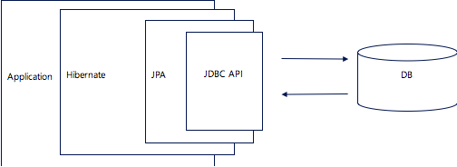

# Week 3 WIL

## JavaDoc

- JDK와 함께 패키지로 제공되는 도구.
- 특정 포맷으로 주석을 달면 HTML 형식의 API 문서를 자동으로 생성해준다.

### 기본 구조

- `/** ... */` : Javadoc 주석 시작/끝
- `@author`: 작성자
- `@version`: 버전
- `@param`: 메소드 매개변수 설명
- `@return`: 반환값 설명
- `@see`, `@since`, `@throws` 등 다양한 태그 지원

### JavaDoc 문서 생성 방법

터미널에 `javadoc [파일이름.java](http://파일이름.java)` 

---

## Swagger

- 작성한 주석을 기반으로 API 명세서를 자동으로 만들어주는 도구
- 문서화된 내용을 통해 관리 및 API 테스트가 가능하다
- 주로 REST API에 대한 주석이기 때문에 `Controller`에 많이 작성함

---

## ORM (Object-Relational Mapping)

Application과 Relational Database를 연결할 때, SQL 언어 대신 객체지향언어를 사용하여 DB에 접근할 수 있게 해주는 툴.

- 장점

DB의 레코드를 하나의 객체처럼 인식하고 작업 → SQL 언어 대신 메소드 호출 → 생산성 증가

테이블 컬럼에 변경사항이 있을때 JPA가 수정사항을 자동으로 반영해준다. → 유지보수 용이

데이터를 객체지향적으로 관리할 수 있음 → 비즈니스 로직에 집중

특정 DataBase에 종속되지 않기에 다른 DB로 쉽게 전환할 수 있다.

- 단점

직접 SQL을 호출하는 것보다 성능이 저하될 수 있다.

불필요한 추상화가 추가되어 디버깅이 어려울 수 있다.

복잡하거나 세밀한 작업이 필요한 쿼리를 작성하기에는 무리가 있다.

 

JPA (Java Persistent API) : JAVA ORM 기술에 대한 API 표준 명세 (ORM을 사용하기 위한 인터페이스)

Hibernate : JPA 구현체 중 하나

---

## 영속성 컨텍스트(Persistence Context)

Entity를 영구 저장하는 환경. 

애플리케이션과 데이터베이스 사이에서 객체를 보관하는 가상의 데이터베이스와 같은 역할을 한다. 

엔티티 매니저를 통해 엔티티를 저장하거나 조회하면 엔티티 매니저는 영속성 컨텍스트에 엔티티를 보관하고 관리한다.

### Entity Manager

Entity Manager를 통해서 영속성 컨텍스트에 접근, 관리가 가능하다.

EntityManager.persist(entity)

- Entity를 영속성 컨텍스트에 저장
- Entity를 영속화한다는 의미
- DB에 저장하는 것 아님

Spring에서는 Entity Manager : 영속성 컨텍스트 = N:1 관계이다

### Entity의 생명주기

1. 비영속 : 영속성 컨텍스트와 관련이 없는 상태 
2. 영속 : 영속성 컨텍스트에 저장되어 있는 상태 
3. 준영속 : 영속성 컨텍스트에 저장되었다가 분리된 상태
4. 삭제 : 삭제된 상태

